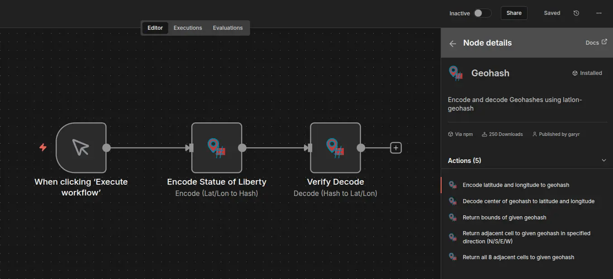

# n8n-nodes-geohash

This is an n8n community node. It lets you encode and decode [Geohashes](https://en.wikipedia.org/wiki/Geohash) directly in your workflows using the [latlon-geohash](https://www.npmjs.com/package/latlon-geohash) library.

## Operations



This node supports the following operations:

* **Encode:** Convert a Latitude and Longitude into a Geohash string.
* **Decode:** Convert a Geohash string into Latitude and Longitude.
* **Get Bounds:** Find the SW/NE bounds of a specific Geohash.
* **Get Adjacent:** Calculate the adjacent cell in a specific direction (North, South, East, West).
* **Get Neighbours:** Get all 8 surrounding cells for a specific Geohash.

## Installation

Follow the [installation guide](https://docs.n8n.io/integrations/community-nodes/installation/) in the n8n community nodes documentation.

1. Go to **Settings > Community Nodes**
2. Select **Install**
3. Enter `n8n-nodes-geohash`
4. Search for node "Geohash"

## Compatibility

* Tested on n8n version 1.0+
* No external credentials or services required.

## Usage

### Encode Example

To convert a coordinate (e.g., the Eiffel Tower) to a hash:

1. Select **Encode**.
2. **Latitude**: `48.8584`
3. **Longitude**: `2.2945`
4. **Precision**: `9`
5. **Output**: `u09tunq63`

### Decode Example

To get coordinates back from a hash:

1. Select **Decode**.
2. **Geohash**: `u09tunq63`
3. **Output**: `{ "lat": 48.8584, "lon": 2.2945 }`

## Resources

* [n8n](https://n8n.io/)
* [latlon-geohash library](https://www.npmjs.com/package/latlon-geohash)

## License

GPL & MIT (latlon-geohash)

## Publishing

```bash
git tag 1.0.2

npm version from-git

git push --follow-tags
```
